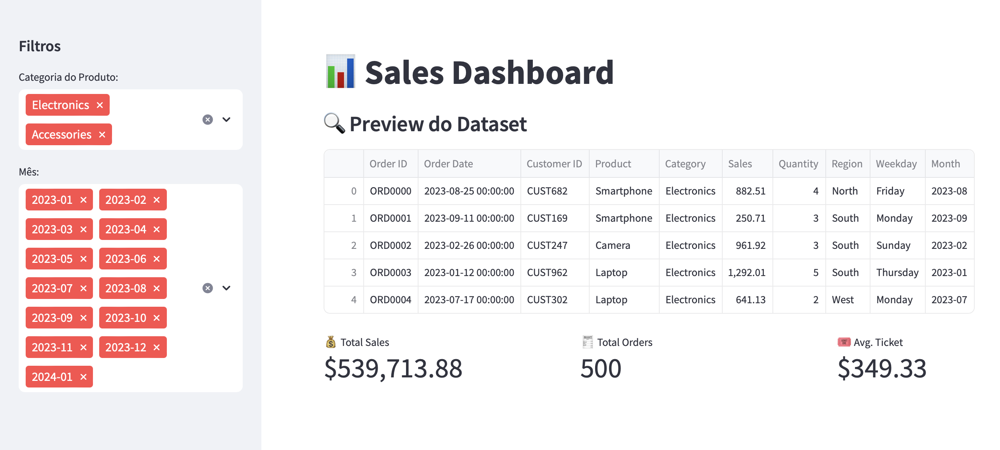

# 📊 Sales Dashboard com Streamlit

Este projeto é um dashboard interativo desenvolvido com Python e Streamlit para análise de dados de vendas. Ele permite visualizar métricas importantes e aplicar filtros por categoria e mês, oferecendo uma visão clara da performance de vendas.

## 💡 Objetivo

Criar um projeto de portfólio que demonstre habilidades em análise de dados, visualização e construção de aplicações interativas com Python.

## 🚀 Funcionalidades

- Filtros interativos (categoria e mês)
- Visualização de dados com tabelas e métricas
- KPIs: total de vendas, número de pedidos e ticket médio
- Design simples e responsivo com Streamlit

## 🛠️ Tecnologias utilizadas

- Python
- Streamlit
- Pandas
- Plotly

## 🧪 Como executar

1. Clone o repositório:
```bash
git clone https://github.com/Leticia-Ducatti/sales-dashboard-project.git
cd sales-dashboard-project
```

2. Instale as dependências:
```bash
pip install -r requirements.txt
```

3. Rode o app:
```bash
streamlit run sales_dashboard.py
```

O navegador abrirá automaticamente com o dashboard.

## 📸 Preview




---

> Projeto desenvolvido para fins educacionais e de portfólio. Sinta-se à vontade para explorar e se inspirar ✨
